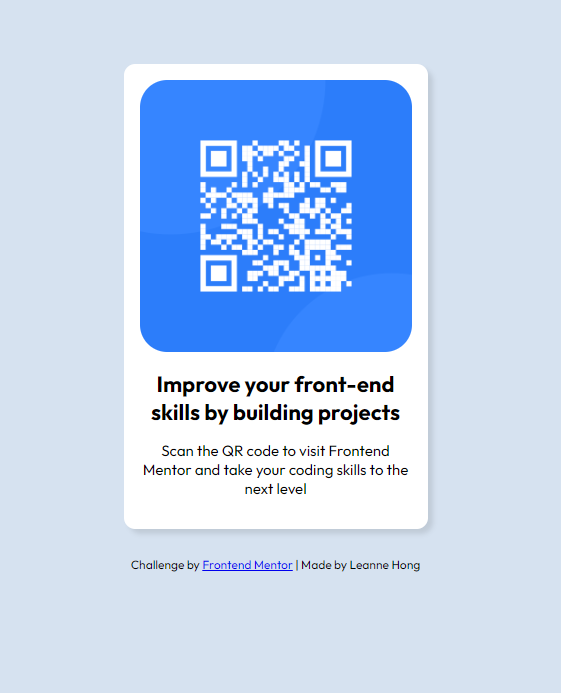

# Frontend Mentor - QR code component solution

This is a solution to the [QR code component challenge on Frontend Mentor](https://www.frontendmentor.io/challenges/[text](http://127.0.0.1:3000/index.html)qr-code-component-iux_sIO_H). Frontend Mentor challenges help you improve your coding skills by building realistic projects. 

## Table of contents

- [Overview](#overview)
  - [Screenshot](#screenshot)
- [My process](#my-process)
  - [Built with](#built-with)
  - [Continued development](#continued-development)
- [Author](#author)

## Overview

This was a QR code component challenge on Frontend Mentor that I have completed. It is a simple card that an user can what the QR code has entailed on the bottom and scan the QR code if they want to. The QR code leads them to the Frontend Mentor website where the user can sign up and do all the different challenges that Frontend Mentor has to offer. 

### Screenshot

## My process

First I downloaded the starter to get a more detailed look into the design. Then I redesign the card in Figma to get a feel on the coding process. From there, I began to create the QR code. It was an easy build but rough in the beginning since it's been awhile since I used HTML and CSS. 

### Built with

- Semantic HTML5 markup
- CSS custom properties

### Continued development

I want to change myself and design a Spotify card. I was inspired by this challenge to create my own. 

Status: Final stage of uploading to GitHub :D

## Author

- Frontend Mentor - [@leannehong](https://www.frontendmentor.io/profile/leannehong)
